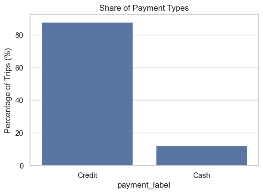
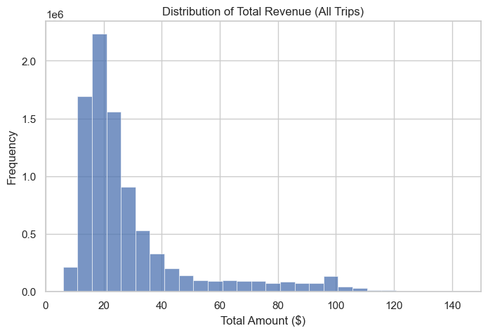
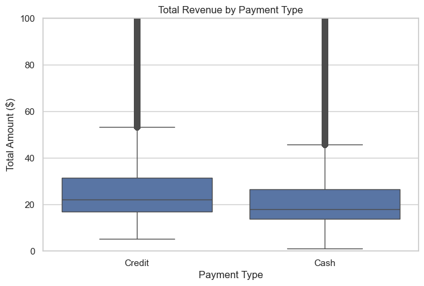
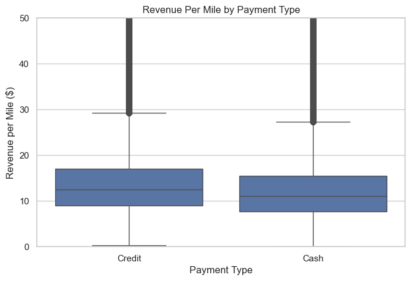
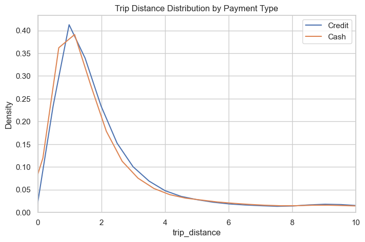
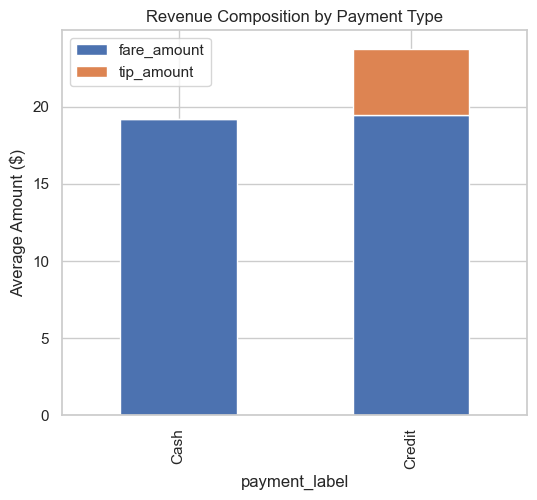
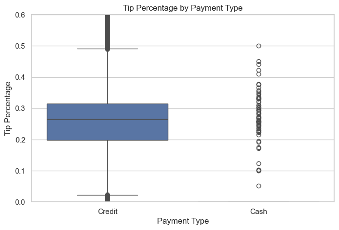
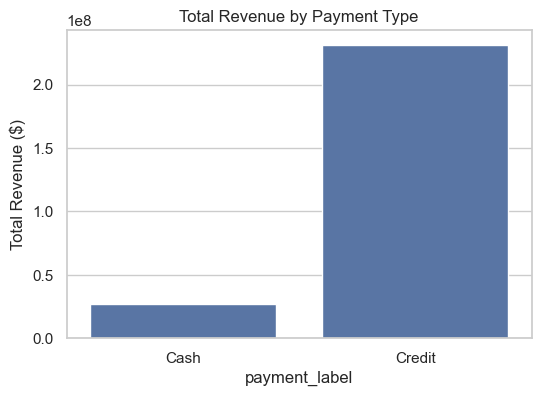

# Payment Type and Driver Revenue: A Statistical Analysis
**NYC TLC Yellow Taxi Data · 2025 · 8.8M Trips**

---

## Overview

This project investigates whether payment method (credit card vs. cash) is associated with statistically significant and economically meaningful differences in taxi driver revenue. The analysis is purely statistical — no predictive modeling — combining exploratory data analysis, non-parametric hypothesis testing, and multivariate regression on real-world trip data.

---

## Research Question

> Is there a statistically significant and economically meaningful difference in total revenue between credit card and cash taxi trips, after controlling for trip characteristics?

---

## Dataset

| Property | Detail |
|---|---|
| Source | [NYC TLC Trip Record Data](https://www.nyc.gov/site/tlc/about/tlc-trip-record-data.page) |
| Vehicle Type | Yellow Taxi |
| Period | January, June, October 2025 (stratified seasonal sample) |
| Format | Parquet |
| Trips after cleaning | **8,826,751** |

| Variable | Description |
|---|---|
| `tpep_pickup/dropoff_datetime` | Trip start and end timestamps |
| `trip_distance` | Distance in miles |
| `payment_type` | 1 = Credit Card, 2 = Cash |
| `fare_amount` | Base metered fare ($) |
| `tip_amount` | Digitally recorded tip ($) |
| `total_amount` | Total charge to passenger ($) |

---

## Data Cleaning

All cleaning decisions were made to preserve statistical validity, not convenience.

- Removed trips with negative or zero fares, distances, and totals
- Removed unrealistic distances (> 100 miles) and charges (> $500)
- Removed trips shorter than 1 minute or longer than 3 hours
- Restricted to **voluntary payment types only**: Credit (1) and Cash (2) — categories 0, 3, 4, 5 excluded as administrative entries, confirmed through tip-behavior analysis
- Derived `trip_duration_min` from timestamps
- Trimmed extreme ratio outliers in `revenue_per_mile` and `tip_percentage` caused by near-zero denominators

---

## Methodology

| Step | Approach | Justification |
|---|---|---|
| Exploratory Analysis | Histograms, boxplots, KDE plots | Assess distributional shape before testing |
| Central Tendency | Median comparisons | Revenue is right-skewed; mean is inflated by outliers |
| Hypothesis Testing | Mann–Whitney U test (non-parametric) | Revenue violates normality assumptions |
| Controlled Comparison | OLS regression | Isolate payment type effect from trip structure |
| Effect Size | Median difference and % gap | Large N makes p-values alone uninformative |

---

## Exploratory Analysis

### Payment Type Share



Credit card accounts for approximately **70% of all trips**, while cash accounts for roughly **10%**. Administrative and undefined categories were excluded from analysis, leaving a clean two-group comparison.

---

### Revenue Distribution



Revenue is **heavily right-skewed**, with most trips concentrated between $10–$30 and a long tail extending beyond $100 (airport rides, longer routes). This skew invalidates parametric testing assumptions — median-based inference and non-parametric tests were used throughout.

---

### Total Revenue by Payment Type



| Payment Type | Median Revenue |
|---|---|
| Cash | $17.95 |
| Credit | $22.05 |
| **Difference** | **+$4.10 (~23%)** |

The median gap is visually clear and economically meaningful. Credit trips show a higher interquartile range and a more extended upper distribution.

---

### Revenue Per Mile



| Payment Type | Median Revenue/Mile |
|---|---|
| Cash | $11.04 |
| Credit | $12.47 |

Even after adjusting for trip distance, credit trips generate more revenue per mile. This rules out trip length as the sole explanation for the revenue gap.

---

### Trip Distance Distribution



Distance distributions for credit and cash trips are **nearly identical** (median: Credit 1.72 mi vs Cash 1.58 mi). The structural similarity in trip characteristics makes the revenue difference more meaningful — it is not driven by longer trips.

---

### Revenue Composition (Fare vs. Tip)



Cash trips are almost entirely fare-based. Credit trips carry a substantial tip component on top of a comparable base fare. This is the **primary mechanism** behind the revenue gap.

---

### Tip Percentage by Payment Type



| Payment Type | Median Tip Percentage |
|---|---|
| Cash | 0% |
| Credit | ~26% |

Cash trips record essentially no digital tips. Credit trips cluster tightly around a 20–30% tipping range. Tipping behavior — enabled by digital payment infrastructure — is the dominant driver of revenue differences.

---

### Total Revenue Contribution



Despite cash representing ~10% of trips and credit ~70%, the absolute revenue contribution gap is further amplified by the per-trip revenue difference.

---

## Statistical Testing

Because revenue distributions are non-normal and right-skewed, the **Mann–Whitney U test** was used for all comparisons.

| Comparison | U Statistic | p-value | Median Difference |
|---|---|---|---|
| Total Revenue | 5.20 × 10¹² | < 0.001 | $4.10 |
| Revenue per Mile | 4.74 × 10¹² | < 0.001 | $1.43/mile |
| Tip Percentage | 8.06 × 10¹² | < 0.001 | ~26 pp |

With 8.8M observations, p-values will be significant for even trivial effects. **Effect size is the relevant measure** — a $4.10 median difference per trip is economically material.

---

## Regression Analysis (Controlled)

To confirm the payment type effect is not simply a proxy for longer trips, an OLS regression was estimated:

```
total_amount ~ is_credit + trip_distance + trip_duration_min
```

| Variable | Coefficient | p-value | Interpretation |
|---|---|---|---|
| `is_credit` | **+4.46** | < 0.001 | Credit trips earn $4.46 more, holding trip structure constant |
| `trip_distance` | +4.15 | < 0.001 | Each additional mile adds ~$4.15 |
| `trip_duration_min` | +0.21 | < 0.001 | Each additional minute adds ~$0.21 |

**R² = 0.877** — as expected, revenue is largely explained by distance and duration. Crucially, `is_credit` remains positive and significant after these controls, confirming the payment type effect is robust.

---

## Economic Interpretation

| Scenario | Estimate |
|---|---|
| Revenue gap per trip | ~$4.10 |
| 20 trips/day | ~$82/day additional |
| 25 working days/month | ~$2,050/month additional |

*Simplified illustrative estimates based on median differences, not predictions. Actual outcomes depend on trip composition and market conditions.*

---

## Limitations

- **Observational data** — association, not causation; no randomized payment assignment
- Geographic zones, time-of-day pricing, and surge effects not explicitly controlled
- Rider demographics unavailable — possible selection effects in payment preference
- OLS residuals are non-normal (expected with skewed revenue); coefficients remain consistent at large N, but standard errors may be slightly underestimated
- Large sample size (8.8M) guarantees statistical significance for trivial differences — effect size is the interpretively relevant metric

---

## Repository Structure

```
├── notebooks/
│   └── revenue_analysis.ipynb       # Full analysis pipeline
├── figures/
│   ├── revenue_distribution.png
│   ├── revenue_by_payment_type.png
│   ├── revenue_per_mile.png
│   ├── tip_percentage.png
│   ├── payment_type_share.png
│   ├── trip_distance_distribution.png
│   ├── revenue_composition.png
│   └── total_revenue_contribution.png
├── requirements.txt
└── README.md
```

---

## Reproducibility

```bash
pip install -r requirements.txt
```

Place TLC parquet files in the working directory and run `notebooks/revenue_analysis.ipynb` end-to-end.

**requirements.txt**
```
pandas
numpy
matplotlib
seaborn
scipy
statsmodels
pyarrow
```

---

## What This Project Demonstrates

- Statistical inference on large-scale, real-world messy data (8.8M records)
- Justified use of non-parametric testing based on distributional properties
- Multivariate regression to isolate variable effects from confounders
- Distinction between statistical significance and practical effect size
- Transparent, reproducible methodology with explicit cleaning decisions and limitations
